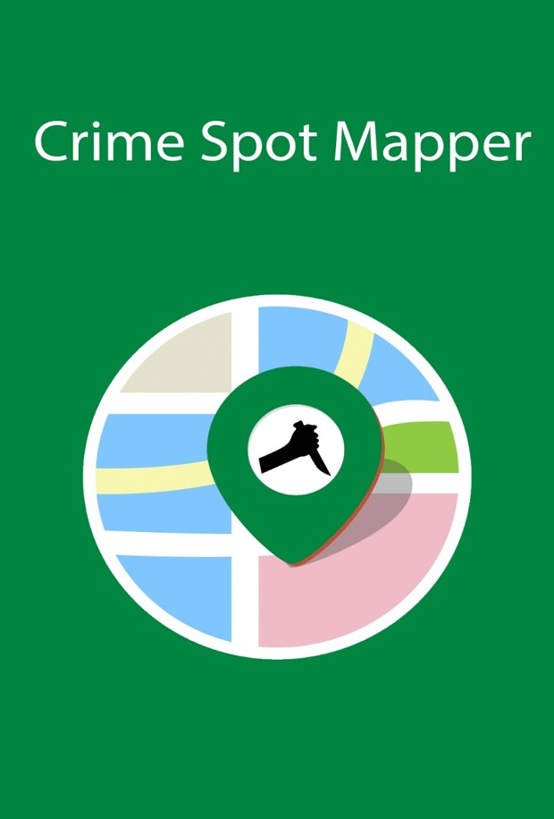
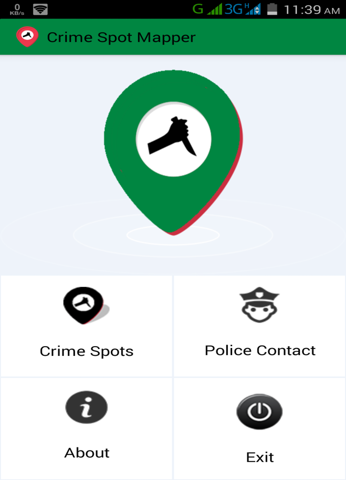
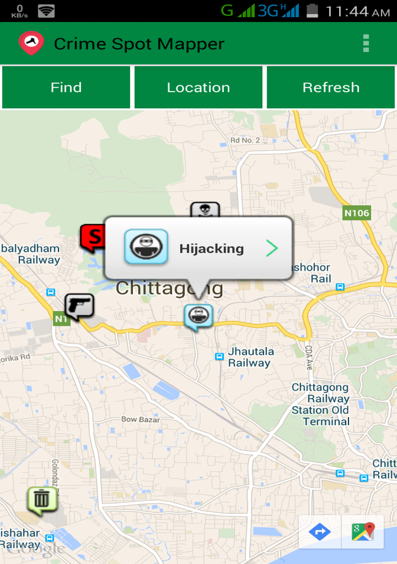
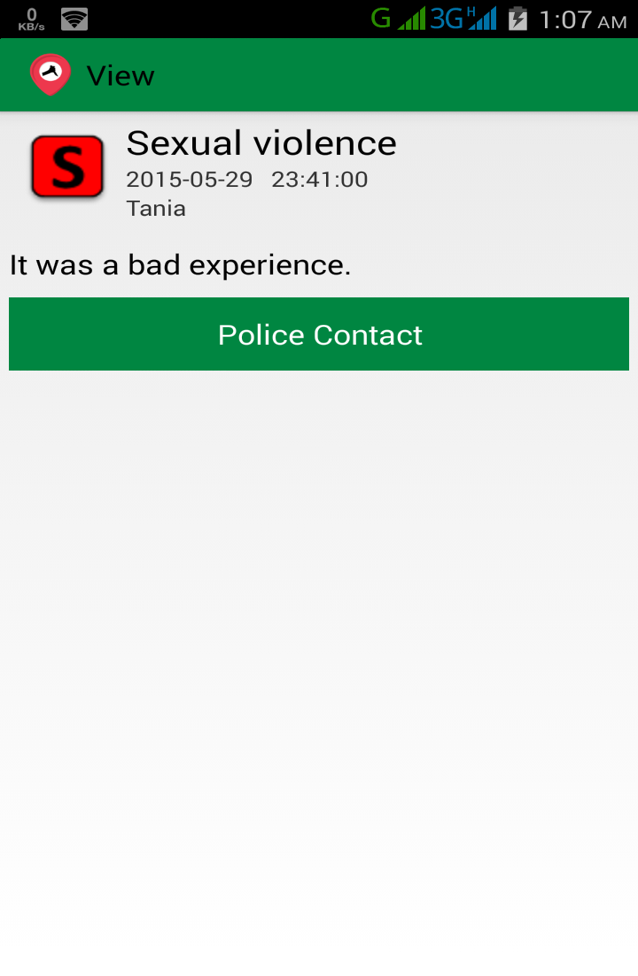
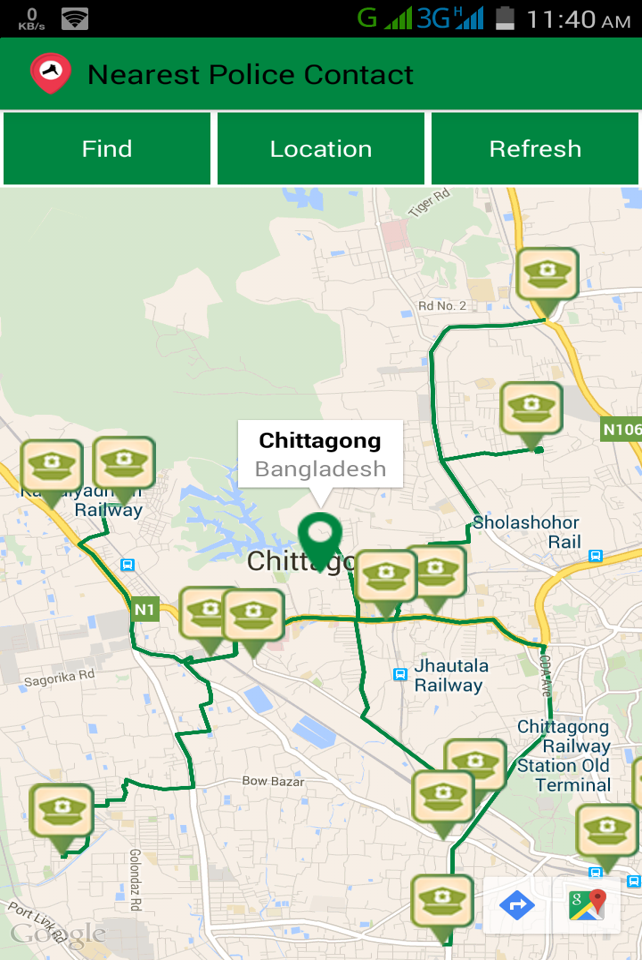
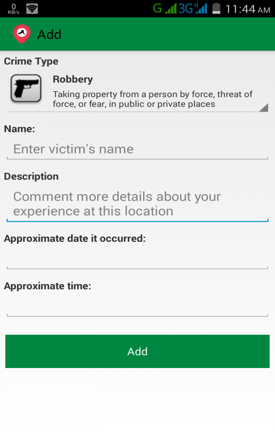
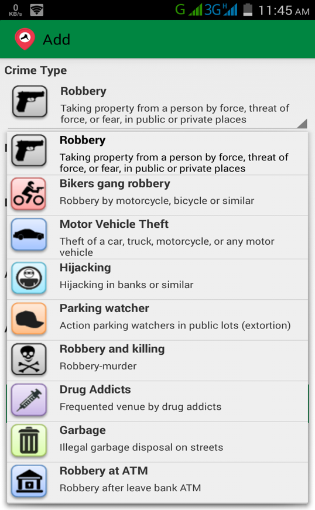

# CrimeSpotMapper

## Description
It's a Google Map based Android Application. Through this App people can mark crime spots. Nearest police stations can be found. Police can detect those marked spots and will take proper actions

## Why this App?

- Through this App people can mark crime spots.
- Nearest police stations can be found.
- Police can detect those marked spots and will take proper actions.
- By using this App information of crimes can be found easily. Also police could be able to detect several crimes in a simple way.

## How people can be benefitted?

- Sometimes we don’t inform police about some crimes because of complexity, risk or police harassment. By this App we can easily mark crime spots and describe particular crime.
- If police take legal actions, ultimately people’s safety can be ensured.
- Number of crimes could be decreased.

## Features

### Showing marked crime spots
If “crime spots” button is clicked it will give all marked crime spots of a locality. If “Find” button is clicked it will ask for a location and then nearest crime spots of that entered location will be shown.

### Showing Crime Details

### Nearest Police station
By clicking on “Police Contact” button and entering a location, nearest police stations will be found. If a specific crime is clicked from map it will also provide nearest police stations from the spot where that crime was happened. It will provide the shortest path to a specific police station from a location.

### Adding new crime spot
By long click on a place on the map new crime spot can be added with crime type and user experience. User also can add the approximate time and date. In our application we specified many crime types. User can select anyone of these items.

### Filtering
This application also provides crimes of last week, last month, last year etc.

### Conclusion
We hope that by using this App people who is the victim of any crime can easily add and describe crime spots. Police will be notified about crimes in a simple way by using this App. Ultimately crime events will be decreased by taking actions in time.
